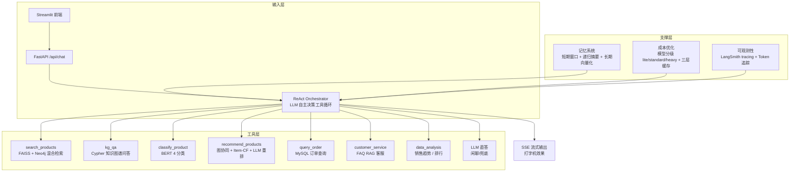

# 电商领域智能体 (E-Commerce Agent)


基于 LangGraph + ReAct Agent + 多工具架构的电商智能助手系统，支持商品搜索、知识图谱问答、商品分类、智能推荐、订单查询、客服 FAQ 等功能。

## v2.0 核心升级

| 升级项 | v1.0 | v2.0 |
|--------|------|------|
| **Agent 架构** | 固定路由 + 固定调用 | ReAct 工具循环 (LLM 自主决策) |
| **记忆系统** | 无 (每次请求独立) | 短期窗口 + 摘要 + 长期向量化记忆 |
| **流式输出** | 阻塞返回 | SSE 逐 token 流式 (打字机效果) |
| **RAG 评估** | 5 条 LLM-as-Judge | Recall@K / NDCG / 忠实度 全维度 |
| **可观测性** | print 日志 | LangSmith tracing + 结构化日志 + Token 追踪 |
| **成本优化** | 关键词路由 + TTL 缓存 | 模型分级(lite/standard/heavy) + Prompt 压缩 + L1/L2/L3 多级缓存(含语义缓存) |
| **推荐评估** | 无 | NDCG/MAP/CTR/CVR 离线评估 + 策略对比 |

## 技术栈

| 层面 | 技术 |
|------|------|
| 编排框架 | LangChain + LangGraph + ReAct Agent |
| LLM | DeepSeek Chat API (模型分级: lite/standard/heavy) |
| 嵌入模型 | BAAI/bge-base-zh-v1.5 (768d) |
| 向量存储 | FAISS + Neo4j 向量索引 |
| 图数据库 | Neo4j 5.26 Community |
| 业务数据库 | MySQL 8.0 (gmall) |
| 后端 | FastAPI + Uvicorn (SSE 流式) |
| 前端 | Streamlit (流式打字机) |
| 可观测性 | LangSmith + 结构化 JSON 日志 |
| 分类模型 | bert-base-chinese (4 分类：手机数码/家用电器/食品生鲜/医药保健) |

## 系统架构



### ReAct 工具循环

v2.0 的核心改进：LLM 不再被固定路由到单个 Agent，而是自主决定：
1. **调哪个工具** — LLM 根据用户意图选择最合适的工具
2. **观察结果** — 工具返回结果后 LLM 判断信息是否充分
3. **再决策** — 可以继续调用其他工具 (如先搜索 → 再分类 → 再推荐)
4. **最终回答** — 基于所有工具结果生成综合回答

### 记忆系统

- **短期记忆**: 滑动窗口保留最近 10 轮对话，超过 6 轮自动摘要
- **长期记忆**: LLM 提取关键事实 (用户偏好、购买决策)，向量化存储到 FAISS
- **上下文构建**: 每次请求注入长期记忆 + 短期摘要 + 最近对话

### 成本优化

- **模型分级**: 闲聊/简单FAQ → lite (deepseek-chat, 512 tokens)，搜索/KG QA → standard (deepseek-chat, 2048 tokens)，推荐/分析 → heavy (deepseek-reasoner R1, 4096 tokens)
- **Prompt 压缩**: 裁剪冗余空白、截断超长 context、压缩 JSON
- **多级缓存**: L1 内存 (TTL 5min) + L2 磁盘 (持久化) + L3 语义缓存 (Embedding 相似度匹配)，非闲聊结果自动缓存

## 技术决策与设计权衡

> 项目演进过程中的关键取舍，也是面试深挖的重点。每个决策都按「备选方案 → 选择 → 理由 → 代价」展开。

### 1. ReAct 工具循环 vs 固定路由

- **备选**: v1.0 的关键词路由 + 固定 Agent 调用
- **选择**: v2.0 以 ReAct（LLM 自主决策工具）为主，保留固定路由作为降级（`orchestration/graph.py`）
- **理由**: 真实用户意图组合多变（如"推荐预算 200 以内的蓝牙耳机"），固定路由无法覆盖；ReAct 支持链式调用（搜索 → 分类 → 推荐）
- **代价**: 多轮 LLM 推理带来额外延迟与 token 成本——通过模型分级、缓存、防死循环回调（`RepeatDetectionCallback`）控制

### 2. 模型分级（lite / standard / heavy）

- **备选**: 所有请求统一使用 deepseek-chat
- **选择**: 闲聊/FAQ → lite（512 tokens），搜索/KG 问答 → standard（2048），推荐/分析 → heavy（deepseek-reasoner R1，4096）
- **理由**: 简单任务用低成本模型，复杂任务才启用推理模型（成本约差 4 倍）
- **代价**: 需要按任务校准 prompt 与超参，路由误判会损失响应质量

### 3. 三层缓存（L1 内存 / L2 磁盘 / L3 语义）

- **备选**: 无缓存或单层 TTL 缓存
- **选择**: L1 内存（TTL 5min）+ L2 磁盘持久化 + L3 Embedding 语义缓存，非闲聊结果自动缓存
- **理由**: 相似问题重复提问时语义缓存直接命中，省掉整次 LLM 调用
- **代价**: 相似度阈值难调——阈值高命中率低，阈值低会误命中（语义相似但答案不同）

### 4. 记忆系统（短期窗口 + 递归摘要 + 长期向量化）

- **备选**: 无状态对话
- **选择**: 滑动窗口 10 轮 + 超过 6 轮自动递归摘要 + LLM 抽取关键事实向量化存储到 FAISS
- **理由**: 既支持多轮连续对话，又避免上下文无限膨胀
- **代价**: 摘要有信息损失，且摘要本身消耗 token；长期记忆质量依赖 Embedding 检索

### 5. 混合检索（FAISS 向量 + Neo4j 图谱）

- **备选**: 纯向量检索或纯关键词
- **选择**: FAISS 向量召回候选 + Neo4j 图谱补充关系（品牌/类目/属性），搜索与知识问答共用
- **理由**: 向量擅长语义相似，图谱擅长关系推理（如"Apple 有哪些产品"）
- **代价**: 两套索引需同步维护；Cypher 存在注入与查询复杂度风险——内置 Text2Cypher 安全校验与 MATCH 子句数量上限

### 6. 降级策略

- 分类模型未加载 → 规则关键词兜底
- ReAct 失败 → 固定路由编排器
- LLM 重排失败 → 返回原始召回结果
- 数据库不可用 → 明确提示而非静默失败

原则：任何单一组件故障都不能让整个系统不可用。

### 7. 设计借鉴与本地化改进

部分模块参考了开源项目设计（`graph.py`/`registry.py`/`search_agent.py` 头部有学习参考标注），关键**本地化改进**包括：

- **防死循环**：ReAct 循环加入 `RepeatDetectionCallback`（相同工具调用重复 N 次即中断）——原参考实现无此保护
- **多级降级**：LLM 重排失败 → 返回原始召回；Agent 崩溃 → 降级 LLM 直答；数据库不可用 → 明确提示，形成完整降级链
- **检索评估闭环**：自研 RAG/推荐/BM25 baseline 三套离线评估（`tests/`），量化混合检索与重排的增益
- **成本分级**：lite/standard/heavy 三级模型路由，重排与长文本任务才启用推理模型

## 迭代历程

- **v1.0**（单 Agent）: 商品搜索 + FAQ 客服，直接 LLM 应答
- **v2.0**（多智能体）: 8 个意图收敛为 4 个领域 Agent（7 个工具）+ LangGraph 状态机编排，引入 ReAct 循环、防死循环回调与多级降级
- **v2.1**（记忆与成本）: 三层缓存（内存/磁盘/语义）+ 短期窗口/递归摘要/长期向量化记忆 + 三级模型路由
- **v2.2**（评估与工程化）: 离线评估体系（RAG/推荐/BM25 baseline）、CI（ruff + pytest + Docker）、架构文档、Docker 上云

## 模型文件说明

> 大型模型文件超出 GitHub 单文件限制，**不随本仓库分发**，按以下方式获取：

| 模型 | 大小 | 获取方式 |
|------|------|---------|
| BERT 商品分类模型（`models/best/`） | ~390MB（加载期 int8 量化后权重内存降约 4 倍） | 自行训练：`python scripts/train_classify_model.py`（训练数据由 `scripts/import_taobao_data.py` 从原始数据集生成，不随仓库分发；当前 65 万样本验证集 acc 99.6% / macro-F1 99.6%）。域外拒识 = 品类关键词黑名单 + 逐类马氏距离门控（`models/best/ood_stats.npz`，重建：`python scripts/build_ood_stats.py`） |
| NER 实体抽取模型（`models/ner/best_model/`） | ~390MB（加载期 int8 量化） | 自行训练：`python scripts/train_ner.py`（6k 训练句，BIO 标注，测试集 F1 0.80）；推理端含 BIO 约束解码 + 相邻同类实体合并，修复实体碎片化 |
| BGE 中文嵌入模型（`BAAI/bge-base-zh-v1.5`） | ~400MB（加载期 int8 量化） | 首次运行自动从 HuggingFace 下载；国内环境可在 `.env` 配置 `HF_ENDPOINT=https://hf-mirror.com`；可用 `MODEL_QUANTIZE=false` 关闭量化 |
| FAISS 索引（`data/faiss_index/`） | ~18MB | 与商品原始数据同源，为保护数据**不随本仓库分发**；准备原始数据后按「快速开始」重建：`python scripts/import_taobao_data.py` → `python scripts/build_faiss_index.py` + `python scripts/build_faq_index.py`。索引缺失时检索 Agent 自动降级并给出明确提示 |

未加载分类模型时，classify Agent 会自动降级到规则关键词兜底方案，不影响系统运行。
模型加载期 int8 动态量化默认开启（仅 CPU 生效），分类/NER 推理提速约 2.5 倍、嵌入提速约 3 倍。

## 快速开始

> **安全默认（H3）**：`API_ACCESS_KEY` 未配置时，所有 `/api/*` 业务请求会被拒绝（503 fail-closed）。
> 启动前请先设置，生成方式：`openssl rand -hex 32`。前端会自动携带该密钥访问后端。

### 方式一：Docker 部署（推荐）

```bash
# 1. 配置环境变量（compose 需要 .env.docker，两处复制同一模板后填写）
cp .env.example .env
cp .env.example .env.docker
# 编辑填入 DeepSeek API Key、Neo4j/MySQL 密码、API_ACCESS_KEY 等
# （注意：compose 中的 Neo4j/MySQL 不再对外映射端口，只能容器网络内访问）

# 2. 一键启动
docker compose up -d

# 3. 生成并导入数据（首次；原始数据与导入脚本不随仓库分发）
#    有淘宝原始数据集时，先执行: python scripts/import_taobao_data.py
docker compose exec -T neo4j cypher-shell -u neo4j -p <password> \
  < data/processed/neo4j_import.cypher
#    导入 MySQL（可选，同上先生成 mysql_gmall.sql 后执行）:
docker compose exec -T mysql mysql -u root -p<password> gmall \
  < data/processed/mysql_gmall.sql

# 4. 访问
# 前端: http://localhost:8501
# API:  http://localhost:8002/docs
```

### 方式二：本地开发

```bash
# 1. 创建虚拟环境
python3 -m venv venv
source venv/bin/activate    # Linux
# venv\Scripts\activate     # Windows

# 2. 安装依赖
pip install -r requirements.txt

# 3. 配置环境变量
cp .env.example .env
# 务必设置 API_ACCESS_KEY（未设置时 API 拒绝业务请求）

# 4. 启动 Neo4j 和 MySQL

# 5. 构建索引（需先运行 scripts/import_taobao_data.py 生成数据）
python scripts/build_faiss_index.py
python scripts/build_faq_index.py

# 6. 启动服务
bash scripts/start.sh                          # API 后端
streamlit run frontend/streamlit_app.py --server.port 8501  # 前端
```

## API 接口

| 方法 | 路径 | 说明 |
|------|------|------|
| POST | /api/chat | 统一对话入口（ReAct + 记忆系统） |
| POST | /api/chat/stream | **流式对话入口 (SSE 逐 token)** |
| POST | /api/classify | 独立商品分类 |
| POST | /api/search | 独立商品搜索 |
| GET | /api/agents | 查看已注册 Agent 列表 |
| GET | /api/health | 健康检查（免鉴权） |
| GET | /api/stats | **系统统计 (Token/缓存/记忆聚合口径)** |
| GET | /api/trace | **获取追踪树（需 API Key）** |
| DELETE | /api/session/{id} | **清除会话记忆（短期 + 该会话长期记忆）** |

> 除 `/api/health` 外，所有 `/api/*` 接口都需要请求头 `X-API-Key: <你的 API_ACCESS_KEY>`。

### 流式对话示例

```bash
curl -X POST http://localhost:8002/api/chat/stream \
  -H "Content-Type: application/json" \
  -H "X-API-Key: <你的 API_ACCESS_KEY>" \
  -d '{"message":"搜索蓝牙耳机","session_id":"test123"}' \
  --no-buffer
```

## 评估系统

> 离线评估覆盖检索、排序、生成质量与成本，脚本见 `tests/`。CI 同时保证代码质量与单元测试通过。

### 已有结果

> 检索/排序指标为**本机真实运行**产出（2026-08-20）；生成指标需有效 `DEEPSEEK_API_KEY` 后回填；推荐评估需在部署环境（Neo4j/MySQL 就绪）执行，见下方一键脚本。

| 任务 | 指标 | 结果 | 复现方式 |
|------|------|------|----------|
| 商品分类 | Accuracy | 95.97% | `python scripts/train_classify_model.py`（约 10 epochs） |
| 商品分类 | 验证集 F1 | 99.59% | 4 分类（增强数据 65 万条） |
| RAG 检索 | Recall@1 / @3 / @5 | 0.193 / 0.580 / 0.700 | `python tests/rag_evaluation.py`（10 个搜索用例） |
| RAG 检索 | Precision@5 | 0.840 | 同上 |
| RAG 检索 | MRR / NDCG@5 / Hit Rate@5 | 1.000 / 1.000 / 1.000 | 同上（pseudo-labeling ground truth，见下方说明） |
| RAG 检索（中立 GT） | NDCG@5 | **1.000 vs BM25 0.557（+79.7%）** | `python tests/bm25_baseline.py` |
| RAG 检索（中立 GT） | MRR | **1.000 vs BM25 0.667（+50.0%）** | 同上 |
| FAQ 客服检索 | 平均延迟 | ~270ms | 同上 RAG 评估（5 个客服用例） |
| RAG 生成 | Faithfulness / Answer Relevance / Context P/R | 0.9667 / 0.6000 / 0.4000 / 0.6333 | 完整环境（hybrid）实测，重跑 `tests/rag_evaluation.py` |
| 推荐排序 | NDCG@5 / HitRate@5 | 0.0431~1.0000 / 0.2500~1.0000（五策略） | 本机完整环境实测，见下方「推荐策略 baseline 对比」 |

### BM25 Baseline 对比

新增关键词检索 baseline（jieba 分词 + BM25Okapi），用**中立的关键词匹配 ground truth**（不依赖任一检索方法，避免自举偏差）验证向量语义检索的有效性：

```bash
python tests/bm25_baseline.py
```

| 指标 | BM25 | 向量检索 | Δ |
|------|-----:|---------:|-----:|
| NDCG@5 | 0.5565 | 1.0000 | **+0.4435 (+79.7%)** |
| MRR | 0.6667 | 1.0000 | **+0.3333 (+50.0%)** |
| Precision@5 | 0.5333 | 1.0000 | **+0.4667 (+87.5%)** |
| Hit Rate@5 | 0.6667 | 1.0000 | **+0.3333 (+50.0%)** |

> 有效用例 6 个（跳过 4 个合成商品名不含细粒度品类词的用例）。完整明细见 `tests/bm25_baseline_report.md`。

### RAG 评估

```bash
python tests/rag_evaluation.py          # 本机（纯向量检索模式；Neo4j 缺失时自动降级）
bash scripts/eval_recommendation.sh --rag   # 部署环境（FAISS + Neo4j 全文检索完整模式）
```

评估指标:
- **检索**: Recall@1/3/5, Precision@5, MRR, NDCG@5, Hit Rate@5
- **生成**: Faithfulness, Answer Relevance, Context Precision/Recall
- **性能**: 延迟、Token 消耗

> **Ground truth 说明**: 检索用例使用伪相关标注（向量 Top-3 + 关键词匹配）动态构建 ground truth，
> MRR/NDCG 偏乐观（自举偏差）；**中立对比请以 BM25 Baseline 表格为准**。

### 完整环境（hybrid）检索策略对比

在 Neo4j + MySQL + FAISS 完整环境下，对 10 个搜索用例在**同一 pseudo-label GT** 下对比三种检索策略：

| 指标 | keyword_only | vector_only | hybrid |
|------|-------------:|------------:|-------:|
| recall@1 | 0.0312 | 0.1646 | 0.0646 |
| recall@3 | 0.0875 | 0.4938 | 0.2604 |
| recall@5 | 0.1500 | 0.5563 | 0.4500 |
| precision@5 | 0.5800 | 0.8400 | 0.7600 |
| mrr | 0.6125 | 1.0000 | 0.8333 |
| ndcg@5 | 0.5786 | 1.0000 | 0.8131 |
| hit_rate@5 | 0.6000 | 1.0000 | 1.0000 |

> 该表 GT 与上方同源（伪相关标注），vector_only 天然占优；hybrid 相对 keyword_only 的 NDCG@5 提升（0.81 vs 0.58）与 HitRate@5（1.0 vs 0.6）是可靠结论，且 hybrid 额外支持分类/价格过滤与图谱关系补充。中立口径的绝对对比以 BM25 Baseline 为准。

### 推荐评估

```bash
# 部署环境执行（Neo4j + MySQL 就绪）
bash scripts/eval_recommendation.sh        # 推荐评估
bash scripts/eval_recommendation.sh --all  # 推荐 + 完整 RAG 评估
```

评估指标:
- **排序**: NDCG@5/10, MAP@5/10, MRR, Hit Rate@5/10
- **多样性**: Coverage, Intra-list Diversity, Novelty
- **模拟**: CTR@K, CVR@K
- **策略对比**: popularity / graph_only / item_cf_only / graph+item_cf / graph+item_cf+LLM_rerank 五策略 baseline

### 推荐策略 baseline 对比（8 个用例，完整环境实测）

| 策略 | NDCG@5 | MAP@5 | MRR | HitRate@5 | 多样性 | CTR | CVR | 延迟 |
|------|-------:|------:|----:|----------:|-------:|----:|----:|-----:|
| popularity（热门兜底） | 0.0431 | 0.0175 | 0.0875 | 0.2500 | 0.0000 | 0.1305 | 0.5000 | 5ms |
| graph_only（仅图协同） | 0.4808 | 0.4000 | 0.7500 | 0.7500 | 0.4000 | 0.5838 | 0.5250 | 6ms |
| item_cf_only（仅协同过滤） | 1.0000 | 1.0000 | 1.0000 | 1.0000 | 0.2000 | 0.8057 | 0.7000 | 58ms |
| graph+item_cf（融合，无重排） | 1.0000 | 1.0000 | 1.0000 | 1.0000 | 0.2000 | 0.8109 | 0.7000 | 56ms |
| graph+item_cf+LLM 重排（完整管线） | 1.0000 | 1.0000 | 1.0000 | 1.0000 | 0.2000 | 0.7951 | 0.7500 | 4568ms |

> 结论：① 融合 Item-CF 是把 HitRate@5 从 0.75 拉到 1.00 的关键（图关系与行为数据互补）；② LLM 重排在本小数据集上不改变排序结构，但提升模拟 CVR（0.70 → 0.75），代价是延迟从 56ms 增至 4.6s——线上可按场景开关；③ 热门商品兜底最差，印证个性化必要性。GT 为 pseudo-label（偏好分类 + 关键词匹配），绝对数值高于真实人工标注场景，相对对比有效。

### LLM as Judge 评估

```bash
python tests/evaluate.py
```

## 环境变量

| 变量 | 默认值 | 说明 |
|------|--------|------|
| `REACT_ENABLED` | true | 启用 ReAct 工具循环 |
| `STREAMING_ENABLED` | true | 启用流式输出 |
| `MEMORY_LONG_TERM_ENABLED` | true | 启用长期记忆 |
| `MEMORY_WINDOW` | 10 | 短期记忆窗口大小 |
| `TRACING_ENABLED` | false | 启用 LangSmith tracing |
| `LANGSMITH_API_KEY` | | LangSmith API Key |
| `LITE_MODEL` | deepseek-chat | 简单任务使用的模型 |
| `API_ACCESS_KEY` | **必填** | API 访问密钥；未配置时所有 `/api/*` 业务请求被拒绝（fail-closed） |
| `TRUSTED_USER_ID_HEADER` | 空 | 可信代理注入的用户身份头（如 X-User-Id）；不配置则订单 PII 自动脱敏 |
| `TRUST_PROXY` | false | 是否部署在可信反向代理之后（仅此时信任 X-Forwarded-For） |
| `CORS_ORIGINS` | localhost | 允许的跨域来源（逗号分隔） |
| `MEMORY_SHARED_ENABLED` | false | 跨会话共享记忆（默认关闭，防用户偏好串味） |

## 安全与隐私加固

本轮已修复的安全缺陷（详见 `docs/SECURITY.md`）：

- **越权查单（IDOR）**：`user_profile` 不再承载身份字段，`user_id` 只能由可信反向代理通过 `TRUSTED_USER_ID_HEADER` 注入；未配置时订单收货人/地址自动脱敏。
- **跨用户缓存泄露**：订单（order）意图的回答禁止写入/命中共享缓存。
- **默认零鉴权**：`API_ACCESS_KEY` 未配置时 API fail-closed（503）；前端自动携带 `X-API-Key`；docker-compose 不再对外映射数据库端口，faiss 索引目录只读挂载，容器以非 root 运行。
- **限流伪造**：仅当 `TRUST_PROXY=true` 时才信任 `X-Forwarded-For`。
- **记忆隐私**：`session_id` 缺省或为 `default` 时不启用记忆（多轮对话请传入唯一 session_id）；跨会话共享记忆默认关闭；清除会话会同时删除该会话的短期与长期记忆；`/api/stats` 只返回聚合口径。
- **其他**：SSE 错误脱敏、系统提示注入防线、磁盘缓存过期清理、Token 明细记录上限、依赖版本上限、追踪不记录原始工具输入。

## 项目结构

```
ecommerce-agent/
├── api/
│   └── app.py                   # FastAPI API (含 SSE 流式端点)
├── agents/
│   ├── tools/base.py            # 工具基类
│   ├── catalog_agent.py         # ★ 商品域 Agent（搜索/推荐/分类）
│   ├── business_data_agent.py   # ★ 业务数据域 Agent（订单/分析）
│   ├── search_agent.py          # 商品搜索组件
│   ├── kg_qa_agent.py           # 知识图谱问答 Agent
│   ├── classify_agent.py        # 商品分类组件
│   ├── recommend_agent.py       # 推荐组件
│   ├── order_agent.py           # 订单组件
│   ├── cs_agent.py              # 客服 Agent
│   └── analytics_agent.py       # 数据分析组件
├── orchestration/
│   ├── router.py                # 意图路由器
│   ├── graph.py                 # 固定路由编排器 (降级方案)
│   ├── react_orchestrator.py    # ★ ReAct 工具循环编排器
│   ├── memory.py                # ★ 记忆系统 (短期+长期)
│   ├── model_router.py          # ★ 成本优化 (模型分级+缓存)
│   ├── observability.py         # ★ 可观测性 (tracing+日志+token)
│   └── registry.py              # Agent 注册中心
├── frontend/
│   └── streamlit_app.py         # Streamlit UI (支持流式)
├── config/
│   └── settings.py              # 统一配置
├── tests/
│   ├── rag_evaluation.py        # ★ RAG 评估体系
│   ├── recommendation_eval.py   # ★ 推荐离线评估
│   ├── evaluate.py              # LLM as Judge 评估
│   └── test_agents.py           # Agent 单元测试
├── data/
│   ├── faiss_index/             # FAISS 索引
│   ├── memory_store/            # ★ 记忆持久化存储
│   ├── cache/                   # ★ 磁盘缓存
│   └── processed/               # 数据产物（gitignored，由脚本生成）
├── docs/
│   └── ARCHITECTURE.md          # 系统架构设计文档
├── scripts/
├── requirements.txt
├── docker-compose.yml
└── README.md
```

## License

MIT License，详见 [LICENSE](LICENSE)。
