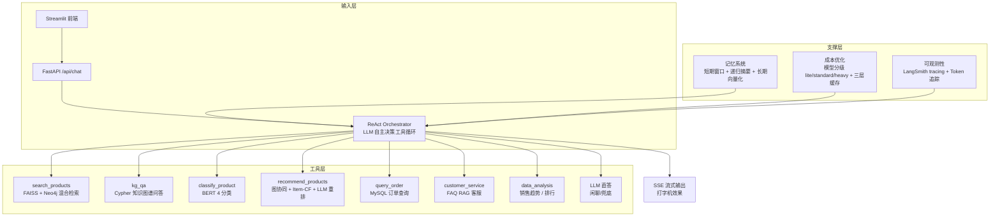

# 电商领域智能体 (E-Commerce Agent)


基于 LangGraph + ReAct Agent + 多工具架构的电商智能助手系统，支持商品搜索、知识图谱问答、商品分类、智能推荐、订单查询、客服 FAQ 等功能。

## v2.0 核心升级

| 升级项 | v1.0 | v2.0 |
|--------|------|------|
| **Agent 架构** | 固定路由 + 固定调用 | ReAct 工具循环 (LLM 自主决策) |
| **记忆系统** | 无 (每次请求独立) | 短期窗口 + 摘要 + 长期向量化记忆 |
| **流式输出** | 阻塞返回 | SSE 逐 token 流式 (打字机效果) |
| **RAG 评估** | 5 条 LLM-as-Judge | Recall@K / NDCG / 忠实度 全维度 |
| **可观测性** | print 日志 | LangSmith tracing + 结构化日志 + Token 追踪 |
| **成本优化** | 关键词路由 + TTL 缓存 | 模型分级(lite/standard/heavy) + Prompt 压缩 + L1/L2/L3 多级缓存(含语义缓存) |
| **推荐评估** | 无 | NDCG/MAP/CTR/CVR 离线评估 + 策略对比 |

## 技术栈

| 层面 | 技术 |
|------|------|
| 编排框架 | LangChain + LangGraph + ReAct Agent |
| LLM | DeepSeek Chat API (模型分级: lite/standard/heavy) |
| 嵌入模型 | BAAI/bge-base-zh-v1.5 (768d) |
| 向量存储 | FAISS + Neo4j 向量索引 |
| 图数据库 | Neo4j 5.26 Community |
| 业务数据库 | MySQL 8.0 (gmall) |
| 后端 | FastAPI + Uvicorn (SSE 流式) |
| 前端 | Streamlit (流式打字机) |
| 可观测性 | LangSmith + 结构化 JSON 日志 |
| 分类模型 | bert-base-chinese (4 分类：手机数码/家用电器/食品生鲜/医药保健) |

## 系统架构



### ReAct 工具循环

v2.0 的核心改进：LLM 不再被固定路由到单个 Agent，而是自主决定：
1. **调哪个工具** — LLM 根据用户意图选择最合适的工具
2. **观察结果** — 工具返回结果后 LLM 判断信息是否充分
3. **再决策** — 可以继续调用其他工具 (如先搜索 → 再分类 → 再推荐)
4. **最终回答** — 基于所有工具结果生成综合回答

### 记忆系统

- **短期记忆**: 滑动窗口保留最近 10 轮对话，超过 6 轮自动摘要
- **长期记忆**: LLM 提取关键事实 (用户偏好、购买决策)，向量化存储到 FAISS
- **上下文构建**: 每次请求注入长期记忆 + 短期摘要 + 最近对话

### 成本优化

- **模型分级**: 闲聊/简单FAQ → lite (deepseek-chat, 512 tokens)，搜索/KG QA → standard (deepseek-chat, 2048 tokens)，推荐/分析 → heavy (deepseek-reasoner R1, 4096 tokens)
- **Prompt 压缩**: 裁剪冗余空白、截断超长 context、压缩 JSON
- **多级缓存**: L1 内存 (TTL 5min) + L2 磁盘 (持久化) + L3 语义缓存 (Embedding 相似度匹配)，非闲聊结果自动缓存

## 技术决策与设计权衡

> 项目演进过程中的关键取舍，也是面试深挖的重点。每个决策都按「备选方案 → 选择 → 理由 → 代价」展开。

### 1. ReAct 工具循环 vs 固定路由

- **备选**: v1.0 的关键词路由 + 固定 Agent 调用
- **选择**: v2.0 以 ReAct（LLM 自主决策工具）为主，保留固定路由作为降级（`orchestration/graph.py`）
- **理由**: 真实用户意图组合多变（如"推荐预算 200 以内的蓝牙耳机"），固定路由无法覆盖；ReAct 支持链式调用（搜索 → 分类 → 推荐）
- **代价**: 多轮 LLM 推理带来额外延迟与 token 成本——通过模型分级、缓存、防死循环回调（`RepeatDetectionCallback`）控制

### 2. 模型分级（lite / standard / heavy）

- **备选**: 所有请求统一使用 deepseek-chat
- **选择**: 闲聊/FAQ → lite（512 tokens），搜索/KG 问答 → standard（2048），推荐/分析 → heavy（deepseek-reasoner R1，4096）
- **理由**: 简单任务用低成本模型，复杂任务才启用推理模型（成本约差 4 倍）
- **代价**: 需要按任务校准 prompt 与超参，路由误判会损失响应质量

### 3. 三层缓存（L1 内存 / L2 磁盘 / L3 语义）

- **备选**: 无缓存或单层 TTL 缓存
- **选择**: L1 内存（TTL 5min）+ L2 磁盘持久化 + L3 Embedding 语义缓存，非闲聊结果自动缓存
- **理由**: 相似问题重复提问时语义缓存直接命中，省掉整次 LLM 调用
- **代价**: 相似度阈值难调——阈值高命中率低，阈值低会误命中（语义相似但答案不同）

### 4. 记忆系统（短期窗口 + 递归摘要 + 长期向量化）

- **备选**: 无状态对话
- **选择**: 滑动窗口 10 轮 + 超过 6 轮自动递归摘要 + LLM 抽取关键事实向量化存储到 FAISS
- **理由**: 既支持多轮连续对话，又避免上下文无限膨胀
- **代价**: 摘要有信息损失，且摘要本身消耗 token；长期记忆质量依赖 Embedding 检索

### 5. 混合检索（FAISS 向量 + Neo4j 图谱）

- **备选**: 纯向量检索或纯关键词
- **选择**: FAISS 向量召回候选 + Neo4j 图谱补充关系（品牌/类目/属性），搜索与知识问答共用
- **理由**: 向量擅长语义相似，图谱擅长关系推理（如"Apple 有哪些产品"）
- **代价**: 两套索引需同步维护；Cypher 存在注入与查询复杂度风险——内置 Text2Cypher 安全校验与 MATCH 子句数量上限

### 6. 降级策略

- 分类模型未加载 → 规则关键词兜底
- ReAct 失败 → 固定路由编排器
- LLM 重排失败 → 返回原始召回结果
- 数据库不可用 → 明确提示而非静默失败

原则：任何单一组件故障都不能让整个系统不可用。

### 7. 设计借鉴与本地化改进

部分模块参考了开源项目设计（`graph.py`/`registry.py`/`search_agent.py` 头部有学习参考标注），关键**本地化改进**包括：

- **防死循环**：ReAct 循环加入 `RepeatDetectionCallback`（相同工具调用重复 N 次即中断）——原参考实现无此保护
- **多级降级**：LLM 重排失败 → 返回原始召回；Agent 崩溃 → 降级 LLM 直答；数据库不可用 → 明确提示，形成完整降级链
- **检索评估闭环**：自研 RAG/推荐/BM25 baseline 三套离线评估（`tests/`），量化混合检索与重排的实际影响（含"hybrid 相对纯向量无增益""LLM 重排不改变排序结构"等负结果）
- **成本分级**：lite/standard/heavy 三级模型路由，重排与长文本任务才启用推理模型

## 迭代历程

- **v1.0**（单 Agent）: 商品搜索 + FAQ 客服，直接 LLM 应答
- **v2.0**（多智能体）: 8 个意图收敛为 4 个领域 Agent（7 个工具）+ LangGraph 状态机编排，引入 ReAct 循环、防死循环回调与多级降级
- **v2.1**（记忆与成本）: 三层缓存（内存/磁盘/语义）+ 短期窗口/递归摘要/长期向量化记忆 + 三级模型路由
- **v2.2**（评估与工程化）: 离线评估体系（RAG/推荐/BM25 baseline）、CI（ruff + pytest + Docker）、架构文档、Docker 上云

## 模型文件说明

> 大型模型文件超出 GitHub 单文件限制，**不随本仓库分发**，按以下方式获取：

| 模型 | 大小 | 获取方式 |
|------|------|---------|
| BERT 商品分类模型（`models/best/`） | ~390MB（加载期 int8 量化后权重内存降约 4 倍） | 自行训练：`python scripts/train_classify_model.py`（训练数据由 `scripts/import_taobao_data.py` 从原始数据集生成，不随仓库分发；65.3 万增强训练 / 18.6 万自然分布验证，5 epochs，**acc 99.63% / macro-F1 99.59%**，见 `models/best/training_config.json`）。域外拒识 = 品类关键词黑名单 + 逐类马氏距离门控（`models/best/ood_stats.npz`，重建：`python scripts/build_ood_stats.py`） |
| NER 实体抽取模型（`models/ner/best_model/`） | ~390MB（加载期 int8 量化） | 自行训练：`python scripts/train_ner.py`（6k 训练句，BIO 标注，同分布测试集 F1 0.80；20 条真实短查询抽查 micro-F1 0.50，款式/规格两类为 0，见 `tests/ner_eval_report.json`）；推理端含 BIO 约束解码 + 相邻同类实体合并，修复实体碎片化 |
| BGE 中文嵌入模型（`models/bge-base-zh-v1.5/`） | ~400MB（加载期 int8 量化） | **随仓库分发本地副本**；`.env` 的 `EMBEDDING_MODEL` 必须指向该目录（`config/settings.py` 强制 `HF_HUB_OFFLINE=1`，填 Hub 仓库名会直接加载失败）；可用 `MODEL_QUANTIZE=false` 关闭量化 |
| FAISS 索引（`data/faiss_index/`） | ~18MB | 与商品原始数据同源，为保护数据**不随本仓库分发**；准备原始数据后按「快速开始」重建：`python scripts/import_taobao_data.py` → `python scripts/build_faiss_index.py` + `python scripts/build_faq_index.py`。索引缺失时检索 Agent 自动降级并给出明确提示 |

未加载分类模型时，classify Agent 会自动降级到规则关键词兜底方案，不影响系统运行。
模型加载期 int8 动态量化默认开启（仅 CPU 生效）。加速比未附基准脚本，引用前请按本机环境自行测量。

## 快速开始

> **安全默认（H3）**：`API_ACCESS_KEY` 未配置时，所有 `/api/*` 业务请求会被拒绝（503 fail-closed）。
> 启动前请先设置，生成方式：`openssl rand -hex 32`。前端会自动携带该密钥访问后端。

### 方式一：Docker 部署（推荐）

```bash
# 1. 配置环境变量（compose 需要 .env.docker，两处复制同一模板后填写）
cp .env.example .env
cp .env.example .env.docker
# 编辑填入 DeepSeek API Key、Neo4j/MySQL 密码、API_ACCESS_KEY 等
# （注意：compose 中的 Neo4j/MySQL 不再对外映射端口，只能容器网络内访问）

# 2. 一键启动
docker compose up -d

# 3. 生成并导入数据（首次；原始数据与导入脚本不随仓库分发）
#    有淘宝原始数据集时，先执行: python scripts/import_taobao_data.py
docker compose exec -T neo4j cypher-shell -u neo4j -p <password> \
  < data/processed/neo4j_import.cypher
#    导入 MySQL（可选，同上先生成 mysql_gmall.sql 后执行）:
docker compose exec -T mysql mysql -u root -p<password> gmall \
  < data/processed/mysql_gmall.sql

# 4. 访问
# 前端: http://localhost:8501
# API:  http://localhost:8002/docs
```

### 方式二：本地开发

```bash
# 1. 创建虚拟环境
python3 -m venv venv
source venv/bin/activate    # Linux
# venv\Scripts\activate     # Windows

# 2. 安装依赖
pip install -r requirements.txt

# 3. 配置环境变量
cp .env.example .env
# 务必设置 API_ACCESS_KEY（未设置时 API 拒绝业务请求）

# 4. 启动 Neo4j 和 MySQL

# 5. 构建索引（需先运行 scripts/import_taobao_data.py 生成数据）
python scripts/build_faiss_index.py
python scripts/build_faq_index.py

# 6. 启动服务
bash scripts/start.sh                          # API 后端
streamlit run frontend/streamlit_app.py --server.port 8501  # 前端
```

## API 接口

| 方法 | 路径 | 说明 |
|------|------|------|
| POST | /api/chat | 统一对话入口（ReAct + 记忆系统） |
| POST | /api/chat/stream | **流式对话入口 (SSE 逐 token)** |
| POST | /api/classify | 独立商品分类 |
| POST | /api/search | 独立商品搜索 |
| GET | /api/agents | 查看已注册 Agent 列表 |
| GET | /api/health | 健康检查（免鉴权） |
| GET | /api/stats | **系统统计 (Token/缓存/记忆聚合口径)** |
| GET | /api/trace | **获取追踪树（需 API Key）** |
| DELETE | /api/session/{id} | **清除会话记忆（短期 + 该会话长期记忆）** |

> 除 `/api/health` 外，所有 `/api/*` 接口都需要请求头 `X-API-Key: <你的 API_ACCESS_KEY>`。

### 流式对话示例

```bash
curl -X POST http://localhost:8002/api/chat/stream \
  -H "Content-Type: application/json" \
  -H "X-API-Key: <你的 API_ACCESS_KEY>" \
  -d '{"message":"搜索蓝牙耳机","session_id":"test123"}' \
  --no-buffer
```

## 评估系统

> 离线评估覆盖检索、排序、生成质量与成本，脚本见 `tests/`。CI 同时保证代码质量与单元测试通过。
>
> **数字一致性**：`python tests/check_readme_consistency.py` 会把 README 里的关键指标与
> `tests/*_report.json` 逐条比对（20 项严格校验，LLM Judge 类指标只提示不判失败），
> 并作为独立 job 挂在 CI 上——防止"文档抄了旧数字"这类问题复发。

### 已有结果

> 下表为 **2026-09-15 本机重跑复核**（CPU 环境，Neo4j + MySQL + FAISS 就绪），数字与 `tests/*_report.json` 一一对应。
> 生成类指标由 LLM Judge 打分、单次采样，**同脚本重跑波动明显**（faithfulness 0.9667 → 0.7000），引用时务必标注口径。

| 任务 | 指标 | 结果 | 复现方式 |
|------|------|------|----------|
| 商品分类 | 验证集 Accuracy / macro-F1 | **99.63% / 99.59%** | `models/best/training_config.json`（65.3 万增强训练 / 18.6 万验证，5 epochs） |
| 商品分类（鲁棒性对照） | 均衡子集 / 去重干净子集 / 近重复子集 Accuracy | 99.88% / **99.05%** / 99.80% | `python tests/classify_robustness.py`（4000 + 2000 + 2000 条） |
| 商品分类（无模型对照） | 关键词规则 Accuracy | 45.00%（无命中率 35.95%） | 同上 |
| 分类评估·完整标题（40+17） | Accuracy / Macro-F1 / 域内接受率 | 0.8596 / 0.8328 / 0.8000 | `python tests/classify_eval.py` |
| 分类评估·真实短查询（76+24） | Accuracy / Macro-F1 / 域内接受率 | **0.7500** / 0.7307 / 0.6711 | 同上（短查询中 25% 在增强训练集出现过） |
| 分类评估·短查询未见（57+24） | Accuracy | 0.7654 | 同上（训练集里没出现过的短查询） |
| 分类评估·合并（116+41） | Accuracy / Macro-F1 / OOD 召回 / 域内接受率 / AUROC | 0.7898 / 0.7786 / **1.0000** / 0.7155 / **0.9052** | 同上 |
| NER | 同分布测试集 F1 / 真实短查询 micro-F1 | 0.80 / **0.50**（20 条） | `python scripts/train_ner.py` / `python tests/ner_eval.py` |
| RAG 检索（**人工标注 GT**，35 有效用例） | NDCG@5 / P@5 / MRR / HitRate@5 | **0.9110 / 0.8857 / 0.9857 / 1.0000** | `python tests/rag_evaluation.py`（4 类目共 36 查询，**36/36 人工标注**） |
| RAG 检索·三策略（35 有效用例） | NDCG@5：hybrid / vector_only / keyword_only(BM25) | **0.9110 / 0.9017 / 0.8384** | 同上（自适应加权 + 关键词分支深度 2×top_k + 虚词过滤） |
| RAG 检索·BM25 对照（35 有效用例） | NDCG@5：BM25(jieba+Okapi) / 向量 | 0.8362 / **0.9017**（向量领先 +0.0655） | `python tests/bm25_baseline.py`（**独立对照实现**，与上一行 keyword_only 0.8384 是两套 BM25 代码，不要混用） |
| 检索用例覆盖度 | 4 类目共 36 查询 | 35 个可评估；1 个（巧克力）商品库内无对应商品 | 覆盖度自检见 `tests/build_retrieval_gt.py` |
| FAQ 客服检索（**人工标注 GT**，5 用例） | NDCG@5 / MRR / Recall@3 / HitRate@5 | **0.9839 / 1.0000 / 1.0000 / 1.0000** | 同上（`summary.retrieval_cs`；人工标注 6 条相关判定） |
| FAQ 客服检索 | 延迟 p50 / p90 | 75.8ms / 164.2ms（检索，5 条客服用例；受机器负载影响会波动） | 同上 RAG 评估，按 `type=cs` 拆分（读 `results[].retrieval_latency_ms`） |
| RAG 生成 | Faithfulness / Answer Relevance / Context P / R | 0.7451 / 0.6811 / 0.6854 / 0.6183 | 同上（LLM Judge 采样 2 次取均值；**跨运行波动大，勿引用绝对值**） |

> **LLM Judge 噪声实测**：`--judge-repeat 2`（默认）下，同一次运行内两次采样的最大差值均值仅
> **0.037~0.052**（faithfulness 0.040 / answer_relevance 0.052 / context_precision 0.051 / context_recall 0.037）；
> 但**跨运行**波动更大（faithfulness 历史在 0.70~0.97 之间），因此该组指标只用于纵向对比、不宜引用绝对值。
> 代价：judge 调用 46 → 85 次、单次评估成本约 $0.008 → $0.017。
| 推荐排序（**人工标注 GT**，8 用例，生产默认） | NDCG@5 / MAP@5 / MRR / HitRate@5 | **0.7500 / 0.7004 / 0.8438 / 1.0000** | `python tests/recommendation_eval.py`（`graph+query_aware` 一行 = 生产默认行为，**不含 LLM 重排**） |
| 推荐排序·可选 LLM 重排（**默认关闭**） | NDCG@5 / 延迟 p50 | 0.7943（重跑 0.7943~0.8107） / 4.7s | 同上（`graph+query_aware+llm_rerank`）；开 `RECOMMEND_LLM_RERANK=true` 启用，**跨运行波动** |
| 端到端（15 用例） | 意图准确率 / 质量分 / p90 延迟 | 1.0000 / 6.91 / 1882ms | `python tests/e2e_eval.py`（质量分为 LLM Judge；有效 15/15、失败 0 条，**失败样本已剔除、不再按 0 分计入**；关闭推荐重排后 p90 5662→1882ms） |
| 路由（209 用例） | Accuracy / macro-F1 | **0.9665 / 0.9611**（95% CI 0.932~0.986；**宽松口径** 0.9952） | `python tests/router_eval.py`（61 条手写 + **148 条 LLM 生成并人工过审**；按来源：手写 **1.0000** / 生成 0.9527；按层：关键词层 0.9306、LLM 兜底层 0.9854。**修复前 0.8756**，修复见下） |
| KG-QA（8 用例） | Cypher 生成 / 注入拦截率 / 端到端答案质量 | 8 例覆盖 4 类问法 / **1.0000**（8/8 拦截 L0~L3 注入） / LLM Judge 打分 | `python tests/kgqa_eval.py`（答案质量为 LLM Judge，未经人工校验） |
| 多轮对话（20 场景 / 59 轮） | Judge 均分 / 关键词覆盖率 / p50 延迟 | 7.73 / 0.9661 / 3679ms | `python tests/multiturn_eval.py`（按类型：相关性 8.46、上下文继承 8.20、话题切换 7.78、长期偏好召回 8.32、**指代消解 6.89 仍是最低**；Judge 未经人工校验。历史：修复"路由不带上下文"后 p50 3822→1847ms、长期偏好召回 7.10→9.12、上下文继承 7.32→8.22） |
| 记忆系统（3 组） | 跨会话迁移 / 长期检索 F1 / 摘要质量 | 严格命中 true（无无关记忆串入） / 0.8571 / 2 例可用 | `python tests/memory_eval.py`（跨会话判定已收紧为"命中期望事实 **且** 不注入无关记忆"） |

> **分类 OOD 拒识的真实机制**：OOD 召回主要由 `ClassifyAgent._is_out_of_domain()` 的**品类关键词黑名单**保证
> （41 条域外用例全部拦下），马氏门控是补充。2026-09-15 复核发现原门控只用手写几十条短查询做参照，
> 导致真实短查询被大量误拒（域内接受率仅 23.7%）；已改为从增强训练集抽取 2000 条短查询做参照、
> 阈值取 p99.5（`python scripts/build_ood_stats.py`）。重建后：短查询接受率 23.7% → 67.1%，
> 短查询准确率 42.0% → 75.0%，AUROC 0.6983 → 0.9052，域外召回保持 1.0000。
>
> **检索 GT 现状（2026-09-15 复核）**：用例集已扩至 **36 个查询（4 个类目）**，全部用 pooling + 人工标注替换伪标注
> （`tests/retrieval_gt_labeled.json`，候选池 `tests/build_retrieval_gt.py`）；35 个可计算排序指标，另 1 个（巧克力）人工标注为"库内无相关商品"。
> 人工标注口径与早期伪标注 / 关键词口径的结论**相反**（伪标注下 vector_only 优于 hybrid；人工标注下 hybrid 最优），
> 说明此前"向量落后/领先"的判断主要由 GT 口径决定，**引用请以上表人工标注行为准**。

### BM25 Baseline 对比

新增关键词检索 baseline（jieba 分词 + BM25Okapi），与向量检索使用**同一份 ground truth**（36 查询全部人工标注）：

```bash
python tests/bm25_baseline.py
```

36 个搜索用例（手机数码 11 / 家用电器 8 / 食品生鲜 8 / 医药保健 9）全部完成 pooling + 人工标注，
其中 35 个可评估（"巧克力"在库内只有巧克力味冰淇淋/蛋糕，无真巧克力，人工标注为空集，不参与指标）：

| 指标 | BM25 | 向量检索 | Δ（向量-BM25） |
|------|-----:|---------:|---------------:|
| NDCG@5 | 0.8362 | **0.9017** | **+0.0655** |
| MRR | 0.8819 | **0.9667** | +0.0848 |
| Precision@5 | 0.8229 | **0.8857** | +0.0628 |
| Recall@5 | 0.3487 | **0.3809** | +0.0322 |
| Hit Rate@5 | 0.9143 | **1.0000** | +0.0857 |

> **结论：向量检索领先**（NDCG@5 0.9017 vs 0.8362）。36 个用例中 21 个有区分度，BM25 拿到最优 25 次、向量 27 次（可并列）。
>
> 规律与 16 用例时一致：**约束词字面出现在商品名里的查询 BM25 更强**（1.5匹空调 1.000 vs 0.699、滚筒洗衣机 1.000 vs 0.723、
> 食品零食 1.000 vs 0.616、热水器/电磁炉 1.000 vs 0.854/0.869）；**语义/意图型与近义表述查询向量更强**
> （打游戏用的手机 0.854 vs 0.000、学生用的笔记本电脑 1.000 vs 0.000、牛奶 1.000 vs 0.000、显示器 1.000 vs 0.854、
> 智能手表 1.000 vs 0.786、相机 0.447 vs 0.131）。
>
> 注意：16 用例时"BM25 略优"、扩到 36 用例后变成"向量领先"——**样本量会改变结论方向**，这也是为什么必须扩样并做留出验证。
> 完整明细见 `tests/bm25_baseline_report.md`。

### RAG 评估

```bash
python tests/rag_evaluation.py          # 本机（纯向量检索模式；Neo4j 缺失时自动降级）
bash scripts/eval_recommendation.sh --rag   # 部署环境（FAISS + Neo4j 全文检索完整模式）
```

评估指标:
- **检索**: Recall@1/3/5, Precision@5, MRR, NDCG@5, Hit Rate@5
- **生成**: Faithfulness, Answer Relevance, Context Precision/Recall
- **性能**: 延迟、Token 消耗

> **Ground truth 说明**: 已标注的搜索用例使用人工 GT（`tests/retrieval_gt_labeled.json`，pooling 流程见 `tests/build_retrieval_gt.py`）；
> 未标注用例回落伪相关标注（向量 Top-3 + 关键词匹配）。后者由于 GT 直接包含召回头部结果，
> **MRR 恒等于 1.0000 属构造所致、不可作为效果指标**。报告按 `gt_source` 分开汇总，**引用请以人工标注子集为准**；
> 客服（FAQ）用例也已人工标注（`tests/retrieval_gt_labeled_faq.json`，5 查询 / 6 条相关判定），
> 检索指标见 `summary.retrieval_cs`；其 GT 规模小（每查询 1~2 条），所以 Precision@5 上限仅 0.4，
> 解读时以 MRR / Recall@3 / NDCG@5 为主。

### 完整环境（hybrid）检索策略对比

在 Neo4j + MySQL + FAISS 完整环境下对比三种检索策略（36 个搜索用例，**36/36 全部人工标注 GT**，35 个可评估）：

| 指标 | keyword_only | vector_only | hybrid |
|------|-------------:|------------:|-------:|
| recall@1 | 0.0736 | **0.0839** | 0.0849 |
| recall@3 | 0.2181 | 0.2376 | **0.2398** |
| recall@5 | 0.3513 | **0.3809** | 0.3801 |
| precision@5 | 0.8286 | 0.8857 | **0.8857** |
| mrr | 0.8881 | 0.9667 | **0.9857** |
| ndcg@5 | 0.8384 | 0.9017 | **0.9110** |
| hit_rate@5 | 0.9429 | 1.0000 | 1.0000 |

> 结论（2026-09-15，36 用例全人工标注、35 个可评估）：**hybrid 在 NDCG@5/P@5/MRR 上最优或并列最优**
> （NDCG@5 0.9110 vs 纯向量 0.9017 vs 纯关键词 0.8384）；35 个用例中 hybrid 达到最优 27 次、向量 25 次、关键词 23 次（存在并列）。
>
> 三点需要知道：
> 1. **hybrid 已启用"按查询类型自适应加权"**（见下节）：启用前 hybrid 0.8844 < 纯向量 0.9017，
>    启用后 0.9046 > 0.9017，重新成为最优。
> 2. **仍有 8 个用例融合后低于单路最优**：相机（0.339 vs 向量 0.447）、显示器（0.869 vs 1.000）、
>    机械键盘（0.956 vs 0.983）、蓝牙音箱（0.830 vs 关键词 1.000）、牛奶（0.515 vs 向量 1.000）、
>    按摩枕（0.786 vs 1.000）、刮痧（0.869 vs 1.000）、运动时戴的耳机（0.470 vs 0.723）——当一路完全失效时，
>    它的候选仍会挤占融合结果，这是下一步优化点。
> 3. **keyword 分支已由 Neo4j 全文索引改为 BM25Okapi**（`SEARCH_KEYWORD_BACKEND=bm25|neo4j`，默认 bm25）；
>    BM25 索引在启动期预热（约 10s，见 `registry.register_all_agents`），首个检索请求不再承担冷启动。

#### RRF 调参记录（2026-09-15，结论：不改动）

`python tests/tune_rrf.py` 对 k 常数（5~100）× 两路权重（7 组）× 关键词分支深度做了 84 组网格搜索：

| 项 | 结果 |
|---|---|
| 最优配置 | 均属"降低关键词权重"一族（如 k=20, w_vec=1, w_kw=0.5） |
| 全量 16 用例 NDCG@5 | 0.9629（线上 k=60 等权为 0.9520，**+0.011**） |
| 逐用例 | 提升 2 个（打游戏用的手机 +0.214、对开门冰箱 +0.131）、下降 3 个（食品零食 −0.131、进口水果礼盒 −0.024、家用吸尘器 −0.015）、持平 11 个 |
| **留出验证**（12 训练 / 4 留出） | 训练集 +0.018，**留出集 −0.010（未提升）** |
| **4 折交叉验证** | 候选配置只在 **2/4** 折上占优 |

> 结论：整体 +0.011 属于"拆东墙补西墙"（把关键词强项用例的得分让给向量强项用例），
> **无法通过留出/交叉验证，故保留默认 k=60 等权**。后续标注更多查询后可重跑该脚本再评估。

#### 按查询类型自适应加权（已实现，2026-09-15 起默认开启）

既然"固定权重调不出来"，改为**按查询类型分别加权**：属性/规格约束型（1.5匹、滚筒、对开、充电、进口、儿童）偏关键词，
意图/语义型（打游戏用的、送给、适合）偏向量，其余等权。实现见 `agents/search_agent.py`
的 `classify_query_type()` / `rrf_weights_for()`，开关 `RRF_ADAPTIVE_WEIGHTS`（默认 true，即默认开启）。

在 **36 个标注查询**（含 4 个意图型、6 个约束型）上的复验（`python tests/tune_rrf.py`）：

| 策略 | 全量 36 用例 NDCG@5 | 留出集 NDCG@5 | 4 折交叉验证 |
|---|---:|---:|---|
| 固定等权（原线上） | 0.8598 | 0.7596 | — |
| **自适应 (0.5,1.5)/(1.5,0.5)** | **0.8833** | **0.7633** | **4/4 折占优** |
| 自适应 (0.6,1.4)/(1.4,0.6) | 0.8799 | 0.7633 | 4/4 折占优 |

> 分组看：plain 0.868（与等权持平）、**structured 0.978**、**intent 0.841**（等权时 intent 只有 0.666）。
> 官方评估确认：hybrid NDCG@5 **0.8844 → 0.9046**（+0.0202，与调参预测 +0.0235 一致），在 35 个有效用例上超过纯向量 0.9017。
> 依据（留出集同向提升 + 4/4 折占优）已于 2026-09-15 默认开启；如需回退，设 `RRF_ADAPTIVE_WEIGHTS=false`。

#### 融合策略对比：共识感知折扣 / 分数归一化（2026-09-15，结论：均不采用）

动机：36 用例中有 5 个"融合后低于单路最优"（牛奶 hybrid 0.316 vs 向量 1.000、运动时戴的耳机 0.384 vs 0.723 等），
原因是**一路失效时，它的候选仍会挤占融合结果**。于是对比三种融合（`python tests/tune_fusion.py`，35 个可评估查询）：

| 融合方式 | 全量 NDCG@5 | 留出集 NDCG@5 | 4 折交叉验证 |
|---|---:|---:|---:|
| RRF + 自适应加权（当前线上） | 0.9140 | **0.8433** | 基线 |
| RRF + 共识折扣 s=0.85/0.7/0.5/0.3 | **0.9140（与基线完全相同）** | 0.8433 | 0/4 折 |
| 分数归一化 + 自适应加权 | **0.9171** | 0.8355 ❌ | 2/4 折 |

> - **共识折扣是空操作**：实测两路 Top-10 平均重叠 3.5/10，但"两路都召回"的候选本来就已经排在前面
>   （它们拿到两份贡献），把单路独有的候选按比例缩小不改变 Top-10 顺序。
> - **分数归一化**：全量 +0.0031，但留出集 −0.0078；逐用例看是"修好 3 个、弄坏 3 个"
>   （牛奶 +0.277、显示器 +0.277、按摩枕 +0.214 vs 相机 −0.422、食品零食 −0.277、打游戏用的手机 −0.131）。
> - 结论：**两者都不满足"留出集提升 + 交叉验证 ≥3/4 折"的准入门槛，继续保留 RRF + 自适应加权**。
>   要真正解决"单路失效"问题需要**分支置信度估计**（不依赖 GT 判断哪一路更可信），当前查询量不足以保证其泛化，列为后续方向。

#### 关键词分支深度（2026-09-15，结论：采用）

同一套准入门槛下，把关键词分支的候选深度从 `top_k`（10）提到 `2×top_k`（20）**通过验证**：

| 配置 | 全量 NDCG@5 | 训练 | 留出 | 4 折交叉验证 |
|---|---:|---:|---:|---:|
| 关键词深度 = 10（原） | 0.9086 | 0.9290 | 0.8396 | 基线 |
| **关键词深度 = 20** | **0.9140** | 0.9350 | **0.8433** | **3/4 折占优** |

> 官方评估确认：hybrid NDCG@5 **0.9046 → 0.9063**、MRR **0.9667 → 0.9714**。
> （此后追加虚词过滤与价格补齐，当前线上为 NDCG@5 **0.9110**、MRR **0.9857**，见上表。）
> 原因：关键词分支的候选太浅时，BM25 的少量命中无法与向量候选充分竞争；给到 20 条后融合空间更大。

#### 商品价格补齐（2026-09-15）

**问题**：商品库 7000 件里有 3000 件（手机数码 / `KD*`）带真实价格，另外 4000 件（4 个类目各 1000，
`JD*`）**没有价格**。后果是"500 元以下""预算 200 以内"这类查询对 4/7 的商品直接失效，
推荐链路的用户画像预算也执行不了。

**做法**（`python scripts/fill_catalog_prices.py`，可按 `--regenerate` 重算）：

1. 原始数据里**确无可用价格**（JD 分类数据只有标题+类目，天猫商品表无价格列），因此按类目分布生成**模拟价格**；
2. 手机数码的分布由该类 3000 条真实价格拟合（几何均值 2816、log σ 0.80），其余三类取行业量级；
3. 主机与配件价差 1~2 个数量级，只按类目分布会把手机壳算成手机价（实测"kindle 保护套"算出 ¥3609），
   因此加了**品类线索覆盖**（配件 / 音频 / 穿戴 / 影像 / 电脑 / 手机、大小家电）；
4. 确定性：随机种子由商品 ID 哈希决定，重复运行结果一致（同一份数据两次生成完全一致）；
5. 每件商品写 `price_source`：`real`（原有真实价格）/ `simulated`（生成），**下游据此区分**。

**红线：模拟价格不参与硬过滤。** 否则"预算 200 以内的蓝牙耳机"这类查询会把真实相关的商品整个滤掉
（实测：把模拟价格当真实价格硬过滤时，推荐 NDCG@5 从 0.91 掉到 0.66）。
因此：检索侧只对 `real` 价格硬过滤，`simulated` 超预算的**后置不删除**（`_apply_soft_budget`）；
推荐侧 `_within_budget()` / `_query_aware_candidates()` 同样只认真实价格。

**效果**：价格约束类查询从"无法评估"变为可用，且结果品类正确、价格落在预算内：

| 查询 | 补齐前 | 补齐后（Top-3 价格） |
|---|---|---|
| 预算 200 以内的蓝牙耳机 | 返回"花胶礼盒"等无关商品（BM25 命中虚词"的"） | ¥75.7 / ¥51.1 / ¥52.0，全部为蓝牙耳机 |
| 1000 元以下手机 | 向量分支被滤空 | ¥784 / ¥825（真实价格） |
| 300 元以内的按摩枕 | 价格未知、无法约束 | ¥92.7 / ¥51.5 / ¥111.8 |

> ⚠️ **引用口径**：模拟价格**不代表真实市场价**，只用于打通价格链路与离线评估；
> 上表检索/推荐指标的口径是"人工标注相关性 + 模拟价格排序"，简历里不要出现"价格准确率"类数字。
> Neo4j 侧只保留了 3000 条真实 SKU 价格（模拟价格不写入图数据库），如需同步可加 `--sync-neo4j`。

### 推荐评估

```bash
# 部署环境执行（Neo4j + MySQL 就绪）
bash scripts/eval_recommendation.sh        # 推荐评估
bash scripts/eval_recommendation.sh --all  # 推荐 + 完整 RAG 评估
```

评估指标:
- **排序**: NDCG@5/10, MAP@5/10, MRR, Hit Rate@5/10
- **多样性**: Coverage, Intra-list Diversity, Novelty
- **模拟**: CTR@K, CVR@K
- **策略对比**: popularity / graph_only / item_cf_only / graph+item_cf / graph+item_cf+LLM_rerank 五策略 baseline

### 推荐策略 baseline 对比（8 个用例，完整环境实测）

> ⚠️ 下表是**改人工标注 GT 之前**的记录：GT 为关键词匹配（规模 1012~4387 条、平均 2285/7000 ≈ 33%），
> 指标被饱和掩盖、**不可引用**，保留仅用于对比修复前后。

| 策略 | NDCG@5（旧关键词 GT，**不可引用**） | 延迟 p50 | 说明 |
|------|-----------:|---------:|------|
| popularity（热门兜底） | 0.2712 | 26.6ms | 按 `sales_count` 排序取前 N |
| graph_only（仅图协同） | 1.0000 ⚠️ 饱和 | 13.7ms | 按画像分类取图内商品 |
| **query_aware（查询意图召回）** | 0.9386 | 120.0ms | 复用搜索链路（向量+BM25+RRF），消费查询文本 |
| **graph+query_aware** | 0.9550 | 109.2ms | 查询意图召回 + 图协同（无重排） |
| **graph+query_aware+LLM 重排** | 1.0000 ⚠️ 饱和 | 4950.9ms | 与生产 `recommend()` 一致；LLM 重排是延迟主因 |
| item_cf_only / graph+item_cf / +LLM | **跳过** | — | MySQL 商品 ID 与商品库交集为 0（见下） |

**✅ 2026-09-15 已改为人工标注 GT（8 用例 / 68 条相关判定），指标首次具备区分度**：

| 策略 | NDCG@5 | MAP@5 | MRR | HitRate@5 | 延迟 p50 |
|------|-------:|------:|----:|----------:|---------:|
| popularity（热门兜底） | 0.0424 | 0.0250 | 0.1250 | 0.1250 | 28.0ms |
| graph_only（原生产只用画像分类） | 0.2251 | 0.1512 | 0.3542 | 0.5000 | 19.5ms |
| graph + LLM 重排（旧管线） | 0.4065 | 0.3638 | 0.5000 | 0.5000 | ~3.6s |
| query_aware（查询意图召回，新） | 0.7500 | 0.7004 | 0.8438 | **1.0000** | 104.1ms |
| **graph+query_aware（= 当前生产默认，无重排）** | **0.7500** | **0.7004** | **0.8438** | **1.0000** | 127.3ms |
| graph+query_aware+LLM 重排（**可选增强，默认关闭**） | 0.7943 | 0.7179 | 0.9375 | **1.0000** | 4678.0ms |

> **结论**：把"只按画像分类推荐"换成"查询意图召回"是本次最大的收益来源——
> NDCG@5 **0.4065 → 0.7500**（旧生产管线 → 查询意图召回，且延迟从 ~3.6s 降到 0.13s）。
>
> **LLM 重排改为默认关闭（2026-09-15）**：它只再加 **+0.044~0.061**（0.7500 → 0.7943/0.8107），
> 却把延迟从 127ms 拉到 4.7s（**约 37 倍**），且评分本身跨运行波动。因此生产默认走"查询意图召回"，
> 需要更高排序质量时用 `RECOMMEND_LLM_RERANK=true` 打开。
> 关闭后端到端延迟同步下降：p50 1091→1001ms、**p90 5662→2089ms**（同一次 e2e 评估口径）；
> 代价是推荐不再附带 LLM 生成的"推荐理由"，端到端 LLM Judge 质量分 6.91（有效 15/15）。
> ⚠️ 这个 ~6.9 是**修掉聚合缺陷之后**的值：旧版把 judge 解析失败的用例按 0 分计入平均（一度算出 6.43），
> 现改为"失败样本剔除 + 被截断的输出按维度抢救 + 报告有效样本数"（见「已知问题」表）。
> 逐用例看，graph_only 在 4 个细粒度查询上完全为 0（蓝牙耳机 / 冰箱洗衣机 / 食品零食 / 血压计维生素）——
> 而这正是原实现"不消费查询意图"的直接后果。

**推荐链路已消费查询意图（本次新增）**：原实现只用画像分类取商品（不区分"蓝牙耳机"与"手机"），
现新增 `_query_aware_candidates()`——复用搜索 Agent 的生产检索入口（向量 + BM25 + RRF）按查询文本召回细粒度候选，
并入候选集后与图协同结果合并输出；开关 `RECOMMEND_QUERY_AWARE`（默认开启，回退旧行为设 false）。
**LLM 重排改为可选（默认关闭）**：见上一节的性价比结论，需要时设 `RECOMMEND_LLM_RERANK=true`。

**本次修复的 3 个缺陷**：

| # | 缺陷 | 修复 | 位置 |
|---|------|------|------|
| 1 | 用例用 15 类旧标签，图谱只有 4 类 → 6/8 用例返回空 | 用例改用图谱实际品类（医药保健/家用电器/手机数码/食品生鲜），修复后 8/8 用例有结果 | `tests/recommendation_eval.py` `generate_test_cases()` |
| 2 | 预算过滤在 `LIMIT` 之后执行 → 图内有货也被滤空 | 价格条件下推到 Cypher；**无价格 / 模拟价格的商品不做预算过滤**（7000 件商品中 3000 件为真实价格、4000 件为生成价格，见「商品价格补齐」） | `agents/recommend_agent.py` `_graph_based_recommend()` |
| 3 | Item-CF 用 MySQL `P*` ID，与商品库/GT 无交集，指标恒为 0 | 评估前校验订单与商品库的 ID 交集，命中即跳过该策略并把原因写入报告（不再输出误导性的 0.0000） | `tests/recommendation_eval.py` `_item_cf_unavailable_reason()` |

> 数据层修复（2026-09-16）：旧 `order_detail` 的 2000 个商品与商品库 7000 个商品**ID 与商品名均无交集**
> （`P000771` vs `JD000001`/`KD000001`），且订单为随机合成（买手机的人同时买汽车用品/服装），Item-CF 无共现信号可学。
> 现用 `python scripts/generate_catalog_orders.py` 重新生成对齐的 `order_detail`：
> `product_id` 取自商品库（`JD*`/`KD*`）、`product_name` 采用 `{品牌}{类目}商品{序号}` 合成名（命中 Item-CF 的
> `LIKE %类目%` 种子查询、且能被 `_pretty_name` 清理）、按用户偏好品牌注入共现结构（爆款锚点 ≥1600 件）。
> 产物为 `data/processed/mysql_catalog_orders.sql`，`mysql -u root -p gmall < data/processed/mysql_catalog_orders.sql`
> 加载后 Item-CF 即可学到真实协同信号。

### LLM as Judge 评估

```bash
python tests/evaluate.py
```

### 已知问题（2026-09-15 复核）

> 下表为本次复核中确认的问题，均会直接影响指标可信度，修复前相关数字不要对外引用。

| 问题 | 位置 | 影响 | 状态 |
|------|------|------|------|
| 推荐用例分类标签与图谱不一致（旧 15 类 vs 图谱 4 类） | `tests/recommendation_eval.py` `generate_test_cases()` | 6/8 用例推荐为空 | ✅ 已修复 |
| 预算过滤在 `LIMIT` 之后执行 | `agents/recommend_agent.py` `_graph_based_recommend()` | 图内有货也被滤空 | ✅ 已修复 |
| Item-CF 使用 MySQL `P*` ID，商品库/GT 为 `JD*`/`KD*` | `tests/recommendation_eval.py` `_item_cf_unavailable_reason()` | 协同过滤指标恒为 0 | ✅ 已加校验并跳过 |
| **推荐 GT 饱和**（关键词 GT 覆盖 1012~4387/7000） | `tests/recommendation_eval.py` `_build_ground_truth()` | 所有策略 HitRate@5/NDCG@5 全为 1.0，指标无区分度 | ✅ 已改人工标注 GT（8 用例 / 68 判定），指标已具备区分度 |
| 订单数据无共现结构且与商品库无交集 | `scripts/import_taobao_data.py` 生成的 `order_detail` | Item-CF 无可学信号 | ✅ 已提供 `scripts/generate_catalog_orders.py`（生成商品库对齐、含共现结构的 order_detail，见下） |
| 推荐链路不消费查询细粒度意图（仅用画像分类） | `agents/recommend_agent.py` `_query_aware_candidates()` | 无法区分"蓝牙耳机"与"手机" | ✅ 已实现查询意图召回（向量+BM25+RRF，`RECOMMEND_QUERY_AWARE` 开关） |
| 检索 GT 自举（向量 Top-3 进入 GT） | `tests/rag_evaluation.py` `_build_ground_truth()` | MRR 恒为 1.000，绝对值不可引用 | ✅ **36/36** 搜索用例已 pooling + 人工标注 |
| 检索用例库内无对应商品（"巧克力"只有巧克力味冰淇淋/蛋糕） | `tests/retrieval_gt_candidates.json` | 该查询人工标注为空集，不参与指标 | ✅ 已自动排除并在报告中列出 |
| BM25 GT 为关键词匹配（偏向 BM25） | `tests/bm25_baseline.py` `build_neutral_ground_truth()` | 向量/BM25 对比方向由 GT 口径决定 | ✅ 已改为人工标注口径（BM25 略优 0.8995 vs 0.8884） |
| RRF 融合在 **8/35** 个用例上低于单路最优 | `agents/search_agent.py` `_reciprocal_rank_fusion()` | 相机 0.339 vs 向量 0.447、牛奶 0.515 vs 1.000、按摩枕 0.786 / 刮痧 0.869 vs 1.000、蓝牙音箱 0.830 vs 关键词 1.000 等；**一路失效时它的候选仍会挤占融合结果** | ⚠️ 已试并否掉三种改法（固定权重调参：留出 −0.010；共识折扣：空操作；分数归一化：留出更差），**下一步需分支置信度估计** |
| 评估脚本在 Windows GBK 控制台下打印 emoji 崩溃 | `tests/*_eval.py`、`tests/evaluate.py` 等 | emoji 汇总打印位于**评估跑完之后、写报告之前** → 整轮评估（含 LLM 调用）作废且报告不落盘 | ✅ 已在 `tests/__init__.py` 与 4 个独立脚本把不可编码字符降级为 `?`（不影响指标） |
| **e2e 质量分把 judge 失败当 0 分计入平均** | `tests/e2e_eval.py` `_compute_summary()`（judge 解析失败时 `tests/evaluate.py` 返回 score=0） | 质量分被系统性低估：曾算出 6.43，实际 **6.9**（重跑 6.95 / 6.91） | ✅ 已修：失败样本剔除、状态三分（ok/partial/failed）、被截断输出**按维度抢救**（不再整条判 0）、judge `max_tokens` 1024→2048；报告新增有效/部分/失败条数 |
| **路由 100% 的口径未标注** | `tests/router_eval.py`（`level1.hit_rate`） | 旧 47 条里 45 条由 Level-1 关键词规则直接命中，用例措辞与规则同源 → 100% 只反映规则覆盖 | ✅ 已修：新增 **14 条口语化换说法用例**（全部不命中 Level-1），现 61 条 / Level-1 命中率 73.77%、**16 条走 LLM 兜底且全部判对**；README 已标注分层口径 |
| **跨会话记忆迁移判定过松** | `tests/memory_eval.py` `evaluate_cross_session_migration()`（`"Python" in ctx_text`） | 只要目标词出现就算命中，**发现不了"把无关记忆一起注入"**：实测上下文里混入另一测试会话的 Java/Spring Boot 记忆，仍判命中 | ✅ 已修：改用**独立临时存储**（不再与同一轮的其它测试共享 store），并新增 `strict_hit`（命中期望事实 **且** 无无关词串入）+ `leaked_terms` |
| **路由不带对话上下文**（追问被路由到错误 Agent） | `orchestration/router.py` `route()` | "那平板呢"被路由到**分类**（判 1.8）；根因有两条：① Level-2 的 LLM 路由 prompt 里没有对话历史；② Level-3"上下文感知"是**死代码**——`_llm_route` 失败也返回 `chitchat`（非空），`if not intent and history` 永不成立 | ✅ 已修：LLM 路由带上最近 3 轮对话 + 明确"省略式追问要延续上文意图"规则；`_llm_route` 失败改为返回 `None` 让 Level-3 真正生效。多轮 Judge 均分 7.85→**8.29**、长期偏好召回 7.10→**9.12**、上下文继承 7.32→**8.22**、p50 3822→1847ms |
| **路由用例太少 + 关键词层过度自信** | `tests/router_eval.py` / `orchestration/router.py` `KEYWORD_RULES` | 用例从 61 扩到 **209** 后，原"100%"跌到 **87.56%**：26 条误路由里 **24 条出在关键词层**——泛动词"买/卖/找/价格"把它们当成确定性命中（单一个"买"字误判 15 次），LLM 兜底层反而 98.2% 准 | ✅ 已修：`WEAK_KEYWORDS` 把"买/卖/找/价格"降级为**弱信号**（命中后继续走 LLM），并补"问候语+购物诉求混说"规则（"你好,我想买耳机"不再被判成闲聊）。经 `tests/tune_router.py` **留出集 +0.1136、4/4 折占优**后上线：**87.56% → 96.65%**；代价是规则层命中率 47.9% → 34.9%（这部分流量多花一次 LLM 调用） |
| 多轮指代消解仍是最弱一环 | `tests/multiturn_eval.py` / `orchestration/react_orchestrator.py` `_persist_entities`、`agents/catalog_agent.py` `merge_entity_context` | "第一款多少钱"没继承上一轮的耳机（判 3.2）；"有降噪功能吗"答成除螨仪/吸尘器（4.4） | ✅ 已实现实体复用：编排器把上一轮 NER 实体存入会话状态（`MemoryManager.set_entity_context`，空实体 no-op 保证链式指代不断链），追问时作为候选实体注入搜索/推荐工具（`merge_entity_context` 回填品牌/商品/款式）。场景集已从 10 扩到 20（59 轮、24 个指代轮次）；重跑后**指代消解 6.89 仍是最低**（旧 10 场景口径 7.33 与新口径不可直接比较；Judge 未人工校验）。品牌/商品/款式指代（"后者""换一个""那款"）已消解，**序数/列表指代**（"第一款""这两个"）与**属性指代**（"白色""这个颜色"）仍失败——需记录上一轮答案的商品列表 + 规格/颜色实体，属后续项 |
| 其它 LLM Judge 未做人工校验 | `tests/rag_evaluation.py`（生成四维）、`tests/kgqa_eval.py`（e2e 质量）、`tests/multiturn_eval.py`（相关性） | 与微调侧同类的"Judge 打分当结论"风险；微调侧实测 Judge 与人工仅中等一致（kappa 0.536）且偏宽 | ⚠️ 已在结果表中统一标注"Judge 未经人工校验，只作相对比较" |
| hybrid 的 keyword 分支原为 Neo4j 全文索引（明显弱于 BM25） | `agents/search_agent.py` `keyword_search()` | 单路关键词 0.7672 → **0.8995** | ✅ 已改为 BM25（保留 Neo4j 回落，`SEARCH_KEYWORD_BACKEND` 可切；启动期预热 10s） |
| 检索评估未走生产入口（未启用价格解析与结构化过滤） | `tests/rag_evaluation.py` `evaluate_search()` | 评估与线上逻辑不一致 | ✅ 已改走 `search_results()`（价格解析生效） |
| **商品库价格覆盖不全**（3000/7000 有真实价格） | `data/processed/products_for_faiss.json` | 价格约束类查询对 4/7 商品失效 | ✅ 已生成模拟价格补齐（`scripts/fill_catalog_prices.py`，带 `price_source` 标记），但**模拟价格不参与硬过滤**、不可当真实市场价引用 |
| 模拟价格来源标记未传到推荐候选 | `agents/recommend_agent.py` `_query_aware_candidates()` | 模拟价格被当真实价格硬过滤，推荐 NDCG@5 0.91 → 0.66 | ✅ 已修复（候选透传 `price_source`，只对真实价格硬过滤） |
| `fill_catalog_prices.py` 重跑会把模拟价格重标成 `real` | `scripts/fill_catalog_prices.py` | 静默污染价格来源，模拟价格被当真实价格过滤 | ✅ 已修复（保留已有 `price_source`，重算需显式 `--regenerate`） |
| LLM 重排默认开启（性价比低） | `config/settings.py` `recommend_rerank_enabled` | 每请求多一次 heavy 调用：+0.04~0.06 NDCG@5，却把延迟从 127ms 拉到 4.7s（37 倍） | ✅ 已改为默认关闭（`RECOMMEND_LLM_RERANK=false`），评估脚本强制开启单独列一行以保留收益口径 |
| 商品库品类覆盖不全（仅 4 个 `Category3`） | `data/processed/products_for_faiss.json` | 母婴/美妆/宠物/户外/鞋类的查询在库内无相关商品 | ✅ 用例集已改为 4 类目 × 4 查询，并加覆盖度自检（每次生成候选池打印同类目候选数，<3 即告警） |
| 商品库存在重复商品（同款多 ID） | `data/processed/products_for_faiss.json` | 如 iPad Air4 有 5 个不同 ID；重复项会虚高 Recall、并让 NDCG/MRR 的"命中"含义变弱 | ✅ 已去重（`scripts/dedupe_catalog.py`，7000→4551，主要是手机数码 3000 个 KD 商品实为 ~551 个型号）；写回后需重建 FAISS/Neo4j |
| 客服（FAQ）检索 GT 曾为伪标注 | `tests/rag_evaluation.py` `CS_TEST_CASES` | FAQ 指标偏乐观 | ✅ 已人工标注（5 查询 / 6 条相关判定），检索指标已纳入报告与 README |
| README 数字与产物脱节（曾出现） | README 评估章节 | 引用到过期/错误数字 | ✅ 新增 `tests/check_readme_consistency.py`（28 项严格比对）+ CI `docs` job 拦截 |
| **`/api/classify` 的 `top_k` 越界崩溃** | `api/app.py` `/api/classify` + `agents/classify_agent.py` `get_top_k()` | 接口允许 `top_k=1~10`，但模型只有 4 个类别，`torch.topk` 直接抛 `RuntimeError: selected index k out of range`；实测 `top_k=5` / `top_k=10` 必崩 | ✅ 已修复：`get_top_k()` 按 `len(labels)` 与 `logits.shape[-1]` 双重裁剪 k，并补回归用例 `tests/test_regression_fixes.py` |
| **防死循环回调实际不生效** | `orchestration/react_orchestrator.py` `RepeatDetectionCallback` | LangChain 的 `CallbackManager.handle_event` 会吞掉回调抛出的异常，只有 `raise_error=True` 才重新抛出；默认 False 时 `on_tool_start` 的 `ValueError` 只打一条 warning，`_invoke_react` 里 `except ValueError` 的中断分支永不触发 | ✅ 已修复：显式 `self.raise_error = True`，并加"经真实 `CallbackManager` 验证能穿透异常"的回归用例 |
| **工具结果从未进入 LLM 上下文** | `orchestration/memory.py` `add_event()` + `orchestration/react_orchestrator.py` `_build_chat_history()` | `add_event()` 写入 `role="tool"`，但 `_build_chat_history()` 只处理 user/assistant/system 三种 role，工具结果被静默丢弃；"那第二个呢"类指代无法指向上一轮候选 | ✅ 已修复：tool 事件降级为 `SystemMessage` 注入（保留最近 3 条、单条截断 1200 字符），不破坏 tool_call 配对协议 |
| **L3 语义缓存跨意图误命中** | `orchestration/model_router.py` `SemanticCache` | 语义缓存只按 query 相似度匹配、不区分 intent，实测 `search|蓝牙耳机 多少钱` 写入后用 `classify` 的 key 查询**相似度 1.0 直接命中**，搜索回答被当成分类回答返回 | ✅ 已修复：引入 namespace（intent + 参数签名）隔离，语义比对只在同一 namespace 内进行，L1/L2 精确键不变 |
| CI 引用的 5 个测试文件未入库 | `.github/workflows/ci.yml` | `test_security_hardening.py` / `test_api_security.py` / `test_robustness.py` / `test_eval_data.py` / `check_readme_consistency.py` 只存在于本地，推送后 CI 必然失败 | ✅ 已修复：全部纳入版本控制 |
| `tests/data/` 误提交真实评估产物 | `tests/data/cache/*.json`、`tests/data/memory_store/memories.json` | 含真实 LLM 回答与评估产生的记忆内容（如 `multiturn_eval_1_...` 会话），且无任何代码引用 | ✅ 已修复：移出版本控制并加入 `.gitignore` |
| LLM Judge 单次采样 | `tests/rag_evaluation.py`、`finetune/scripts/evaluate_llm.py` | 同脚本重跑波动 0.05~0.27 | ⚠️ 已标注口径 |
| 分类 OOD 门控参照样本不足（只有手写几十条短查询） | `scripts/build_ood_stats.py` | 真实短查询被大量误拒（域内接受率 23.7%） | ✅ 已修复（短查询参照 2000 条，接受率 67.1%） |
| 分类评估集偏小 | `tests/classify_eval.py` | 原 40+17 条 | ✅ 已扩至 116+41（含短查询分组） |
| NER 评估集偏小 | `tests/ner_eval.py` | 原 20 条仅作抽查 | ✅ 已扩至 108 条（品牌/商品/款式/规格/复合/闲聊/短查询/边界全覆盖，标注约定已写入脚本） |
| 分类同分布验证集近重复率高（82.08% 验证样本与训练样本共享 ≥12 字前缀） | `scripts/prepare_real_data.py` 的切分方式 | 99.6% 偏高，但**不构成泄漏**：去重干净子集实测 99.05%，与近重复子集（99.80%）仅差 0.75pt；无模型关键词基线仅 45% | ⚠️ 已核实并标注 |

> 已修复项：`.env` 的 `EMBEDDING_MODEL` 原为 Hub 仓库名 `BAAI/bge-base-zh-v1.5`，与 `settings.py` 的强制离线模式冲突，
> 会导致嵌入模型加载失败、检索静默降级为空结果；现改为本地目录 `./models/bge-base-zh-v1.5`。

## 环境变量

| 变量 | 默认值 | 说明 |
|------|--------|------|
| `REACT_ENABLED` | true | 启用 ReAct 工具循环 |
| `STREAMING_ENABLED` | true | 启用流式输出 |
| `MEMORY_LONG_TERM_ENABLED` | true | 启用长期记忆 |
| `MEMORY_WINDOW` | 10 | 短期记忆窗口大小 |
| `TRACING_ENABLED` | false | 启用 LangSmith tracing |
| `LANGSMITH_API_KEY` | | LangSmith API Key |
| `LITE_MODEL` | deepseek-chat | 简单任务使用的模型 |
| `API_ACCESS_KEY` | **必填** | API 访问密钥；未配置时所有 `/api/*` 业务请求被拒绝（fail-closed） |
| `API_RATE_LIMIT` | 60 | 每 IP 每分钟请求上限；**内存态，仅单进程部署下正确**（多 worker 时额度放大 N 倍） |
| `TRUSTED_USER_ID_HEADER` | 空 | 可信代理注入的用户身份头（如 X-User-Id）；不配置则订单 PII 自动脱敏 |
| `TRUST_PROXY` | false | 是否部署在可信反向代理之后（仅此时信任 X-Forwarded-For） |
| `CORS_ORIGINS` | localhost | 允许的跨域来源（逗号分隔） |
| `MEMORY_SHARED_ENABLED` | false | 跨会话共享记忆（默认关闭；开启后也仅在同一 `user_id` 命名空间内共享，不跨用户泄露） |
| `RECOMMEND_QUERY_AWARE` | true | 推荐走"查询意图召回"（向量+BM25+RRF），关掉回退到仅按画像分类 |
| `RRF_ADAPTIVE_WEIGHTS` | true | 混合检索按查询类型自适应加权（约束型偏关键词 / 意图型偏向量），关掉回退固定等权 |
| `RECOMMEND_LLM_RERANK` | **false** | 推荐 LLM 重排（可选）：NDCG@5 +0.04~0.06，但延迟 127ms → 4.7s（37 倍），故默认关闭 |

## 安全与隐私加固

本轮已修复的安全缺陷（详见 `docs/SECURITY.md`）：

- **越权查单（IDOR）**：`user_profile` 不再承载身份字段，`user_id` 只能由可信反向代理通过 `TRUSTED_USER_ID_HEADER` 注入；未配置时订单收货人/地址自动脱敏。
- **跨用户缓存泄露**：订单（order）意图的回答禁止写入/命中共享缓存。
- **默认零鉴权**：`API_ACCESS_KEY` 未配置时 API fail-closed（503）；前端自动携带 `X-API-Key`；docker-compose 不再对外映射数据库端口，faiss 索引目录只读挂载，容器以非 root 运行。
- **限流伪造**：仅当 `TRUST_PROXY=true` 时才信任 `X-Forwarded-For`；限流为内存态，**仅单进程部署下正确**（多 worker 需改用网关/Redis 集中限流）。
- **记忆隐私**：`session_id` 缺省或为 `default` 时不启用记忆（多轮对话请传入唯一 session_id）；跨会话共享记忆默认关闭，且即使开启也只在同一 `user_id` 命名空间内共享（防跨用户偏好泄露）；清除会话会同时删除该会话的短期与长期记忆；`/api/stats` 只返回聚合口径。
- **其他**：SSE 错误脱敏、系统提示注入防线、磁盘缓存过期清理、Token 明细记录上限、依赖版本上限、追踪不记录原始工具输入。

## 项目结构

```
ecommerce-agent/
├── api/
│   └── app.py                   # FastAPI API (含 SSE 流式端点)
├── agents/
│   ├── tools/base.py            # 工具基类
│   ├── catalog_agent.py         # ★ 商品域 Agent（搜索/推荐/分类）
│   ├── business_data_agent.py   # ★ 业务数据域 Agent（订单/分析）
│   ├── search_agent.py          # 商品搜索组件
│   ├── kg_qa_agent.py           # 知识图谱问答 Agent
│   ├── classify_agent.py        # 商品分类组件
│   ├── recommend_agent.py       # 推荐组件
│   ├── order_agent.py           # 订单组件
│   ├── cs_agent.py              # 客服 Agent
│   └── analytics_agent.py       # 数据分析组件
├── orchestration/
│   ├── router.py                # 意图路由器
│   ├── graph.py                 # 固定路由编排器 (降级方案)
│   ├── react_orchestrator.py    # ★ ReAct 工具循环编排器
│   ├── memory.py                # ★ 记忆系统 (短期+长期)
│   ├── model_router.py          # ★ 成本优化 (模型分级+缓存)
│   ├── observability.py         # ★ 可观测性 (tracing+日志+token)
│   └── registry.py              # Agent 注册中心
├── frontend/
│   └── streamlit_app.py         # Streamlit UI (支持流式)
├── config/
│   └── settings.py              # 统一配置
├── tests/
│   ├── rag_evaluation.py        # ★ RAG 评估体系
│   ├── recommendation_eval.py   # ★ 推荐离线评估
│   ├── evaluate.py              # LLM as Judge 评估
│   └── test_agents.py           # Agent 单元测试
├── data/
│   ├── faiss_index/             # FAISS 索引
│   ├── memory_store/            # ★ 记忆持久化存储
│   ├── cache/                   # ★ 磁盘缓存
│   └── processed/               # 数据产物（gitignored，由脚本生成）
├── docs/
│   └── ARCHITECTURE.md          # 系统架构设计文档
├── scripts/
├── requirements.txt
├── docker-compose.yml
└── README.md
```

## License

MIT License，详见 [LICENSE](LICENSE)。
